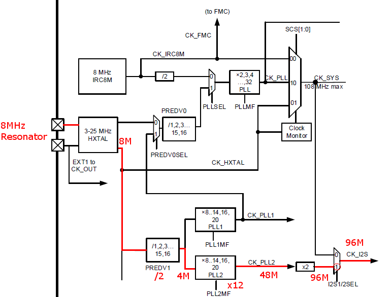
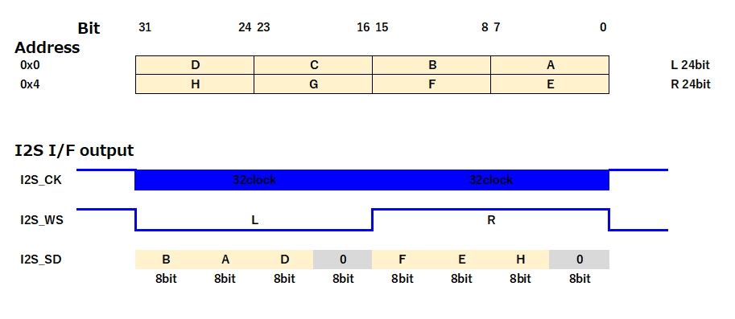

# Longan_Nano_gd32v_i2s_dac
## Function
- Audio DAC ES9023
- Triangle Wave Output by DMA

## DAC ES9023 I2S pins

| ES9023 Pin No. | ES9023 Pin Name | Longan Nano Pin |
----|----|---- 
| 1 | BCK | PB3 |
| 2 | LRCK | PA15 |
| 3 | SDI | PB5 |
| 13 | MCLK | Connect OSC > 192 * fs |

## Clock Path

## I2S Data Assignment in DMA (for reference)

